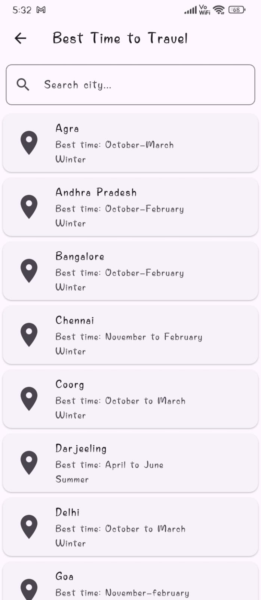
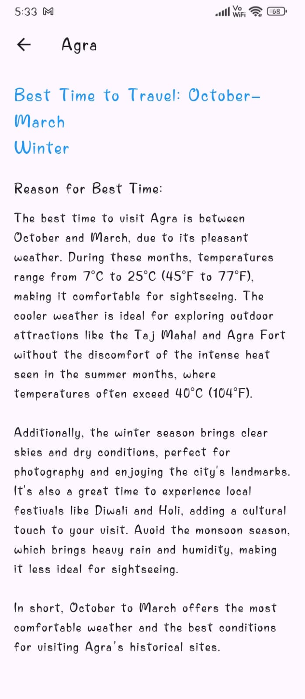
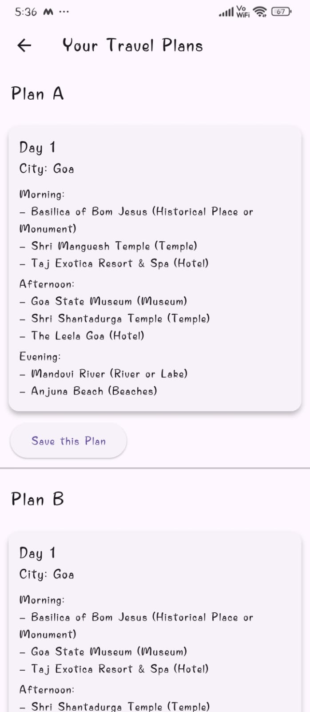
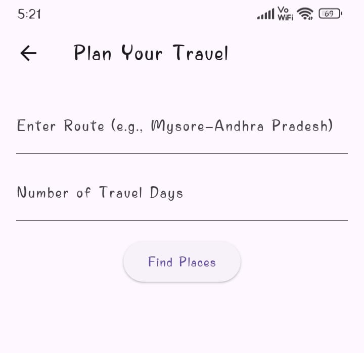
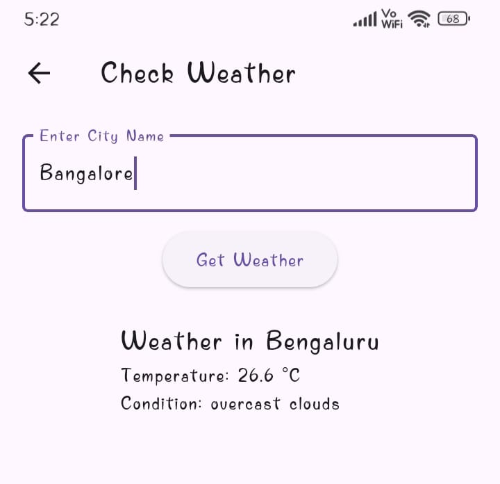

# Travel Planner App (Flutter)

A Flutter application to plan your travels, explore destinations, and manage trips. The app includes features like destination search, weather info, and Firebase integration for saving trips.

## Features
- Search for cities and view suggested places to visit
- Display itineraries with categorized places (temples, gardens, hotels, etc.)
- Check live weather for destinations using OpenWeather API
- Save trips and plans using Firebase Firestore
- Google Maps integration for location viewing
- User authentication via email/password using Firebase Auth

## Screenshots










## Tech Stack
- Flutter & Dart
- Firebase (Authentication, Firestore, Storage)
- Google Maps & Places API
- OpenWeather API

## How to Run
1. Clone the repository:
   ```bash
   git clone https://github.com/YourUsername/travel-planner-app.git
